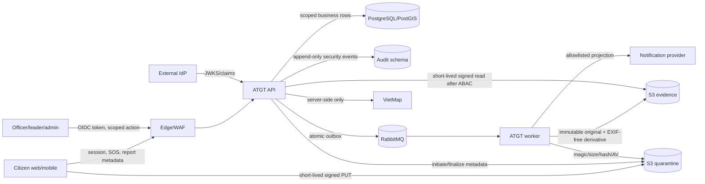

# Threat Model - ATGT Lam Dong Platform

**Status**: ACTIVE — T18A dependency review updated 2026-08-20

## System overview

Ban do so va ung dung an toan giao thong tinh Lam Dong.
Five user groups: citizen/tourist, dispatcher, field officer, leader, system admin.

## Assets to protect

| Asset                    | Classification   | Owner            |
| ------------------------ | ---------------- | ---------------- |
| SOS incident data        | Sensitive        | incidents module |
| Citizen identity linkage | Highly sensitive | privacy vault    |
| Evidence files           | Sensitive        | evidence module  |
| Dispatch unit locations  | Internal         | dispatch module  |
| VietMap API keys         | Secret           | vietmap-client   |
| Officer credentials      | Secret           | identity module  |

## Trust boundaries

1. Public internet -> Edge (HAProxy/WAF) -> API
2. API -> Database (internal network, TLS)
3. API -> RabbitMQ (internal network, TLS)
4. Citizen/API/Worker -> Object storage (signed public PUT plus internal S3, TLS)
5. Officer client -> external IdP -> API (OIDC/JWKS; production pending D-02)
6. API/Worker -> VietMap and notification providers (egress allowlist; pending)

## Data-flow model

| Flow                | Data/classification                                               | Persistence and disclosure boundary                                                                                  | Current gate                                                                |
| ------------------- | ----------------------------------------------------------------- | -------------------------------------------------------------------------------------------------------------------- | --------------------------------------------------------------------------- |
| F1 citizen intake   | Coordinates, description, opaque citizen session; Sensitive       | API allowlist -> scoped report/incident rows; public response is generalized                                         | Strict contract, session capability, idempotency, repository scope          |
| F2 evidence         | Media and SHA-256; Sensitive                                      | Direct signed PUT to quarantine -> worker -> immutable original/derivative; object keys never enter public contracts | HMAC capability, READY-only ownership, magic/size/hash/fake-AV local checks |
| F3 operator actions | OIDC claims and scoped case/map/report action; Internal/Sensitive | Token is not persisted; authorization decision and object reference enter append-only audit                          | Explicit route policy, ABAC plus repository recheck, maker-checker          |
| F4 events           | Versioned allowlisted event payloads; classification varies       | Business write + outbox commit atomically -> RabbitMQ -> idempotent inbox                                            | Executable contracts, PII-negative tests, DLQ/inbox controls                |
| F5 map/provider     | Coordinates/search/map data; Public/Internal                      | Server-side adapter only; provider key reference cannot enter client bundle or logs                                  | Fake local adapter, timeout/shape validation, production fail-closed        |
| F6 notification     | Opaque recipient and citizen-safe projection; Public/Internal     | Worker port only; provider persistence/retention is not yet approved                                                 | Strict template/audience policy; provider registration remains disabled     |

## Threat register (STRIDE)

| ID  | Category               | Threat                    | Current control                                                                                      | Residual risk |
| --- | ---------------------- | ------------------------- | ---------------------------------------------------------------------------------------------------- | ------------- |
| T1  | Spoofing               | Fake SOS flood            | Citizen session, HMAC capabilities, idempotency and manual review of exact-SHA candidate suggestions | High          |
| T2  | Tampering              | Evidence modification     | Magic/size/SHA256 checks + conditional put + versioned original                                      | Medium        |
| T3  | Repudiation            | Deny action taken         | Append-only audit log                                                                                | Low           |
| T4  | Info disclosure        | PII in logs               | Structured logging allowlist                                                                         | Medium        |
| T5  | Info disclosure        | API key in bundle         | Production config rejects raw secrets and requires a secret reference; resolver/provider pending     | High          |
| T6  | Denial of service      | Queue flood               | Bounded payloads, atomic outbox/inbox idempotency and provisioned DLQs                               | High          |
| T7  | Elevation of privilege | Cross-area access         | ABAC + scoped repository                                                                             | Low           |
| T8  | Elevation of privilege | Self-approve data         | Maker-checker (4 eyes)                                                                               | Low           |
| T9  | Spoofing/tampering     | Stolen upload capability  | Citizen session + short TTL + HMAC capability; hash-only DB                                          | Medium        |
| T10 | Tampering/disclosure   | Malicious media/EXIF leak | Quarantine + AV port + EXIF-free watermarked derivative                                              | Medium        |
| T11 | Info disclosure        | Evidence IDOR/signed URL  | Area+case ABAC, repository recheck, short TTL, access audit                                          | Medium        |
| T12 | Spoofing/tampering     | Attach another upload     | Live session + separate report/upload HMAC capabilities + READY-only atomic owner assignment         | Medium        |
| T13 | Tampering              | Heuristic auto-conclusion | Suggestion-only candidate + scoped manual confirm/override + optimistic version + audit/outbox       | Medium        |
| T14 | Tampering/disclosure   | Unsafe or stale alert     | Current public/PUBLISHED version + validity + strict nested source + allowlisted projection          | Medium        |

T10B2 implements the T2/T10 controls only for explicit local/test JPEG/PNG values
and a fake EICAR detector. Production remains fail-closed until the AV/storage
provider, secret resolver and D-09 limits are approved. Quarantine retention and
legal-hold behavior remain pending D-06; no automatic deletion path exists.

T10B3 implements the T11 control locally: the guard evaluates `evidence.view`,
then the repository matches persisted owner/area and reevaluates actual data class.
Scope miss and missing evidence share the same response. Signed URLs are returned
only to the caller, use `no-store`/`no-referrer`, and are excluded from audit and
aggregate metrics. URL forwarding within its short lifetime remains a residual
risk; production TTL/provider controls still require approval.

T11B1 implements T12 only for local/test. Report and upload capabilities are
verified independently; raw capabilities are not written to report, evidence,
audit or outbox rows. Invalid capability, non-READY media and owner conflict are
intentionally indistinguishable. Production remains fail-closed pending the
T10/D-09 gates.

T11B2B1 narrows T13 locally: the idempotent screening consumer can only create a
PENDING suggestion for exact READY-evidence SHA-256 equality in the same area.
It never publishes checksums, writes risk score, or changes a report to a terminal
state. Candidate overflow and persisted-event mismatch roll back inbox, history,
candidate, audit and outbox together. Exact equality can still be a false positive,
so operator confirmation remains mandatory. Time/space/plate/risk/rate/captcha
controls and production enable remain blocked by D-09.

T13A narrows T14 locally: the public endpoint reads only the latest current
PUBLISHED version of explicitly eligible public layers, checks effective feature
and version validity, validates the complete nested alert source, and returns an
allowlisted projection. A malformed current source or configured bound overflow
fails closed. Bbox overlap may still produce alerts that are not on the user's
route; the response states `BBOX_ONLY`, and route/direction/cooldown controls plus
production enablement remain blocked by D-03/D-09.

T1 and T6 deliberately remain High. No approved production rate limit, risk
score, captcha threshold, queue capacity/load target or circuit-breaker policy
exists while D-09 is pending. Existing idempotency, bounded input and DLQ controls
reduce amplification but do not constitute flood protection. T5 also remains High
until the production secret resolver and provider integration are approved and
tested; a fail-closed reference requirement is not evidence that a secret store is
deployed.

## Pentest scope (T18)

- OWASP API Security Top 10
- OWASP ASVS subset (Level 2)
- OWASP MASVS subset (mobile)
- Manual: IDOR, upload bypass, authz logic, business rules
- Tools: SAST, DAST, SCA, container scan, IaC scan
